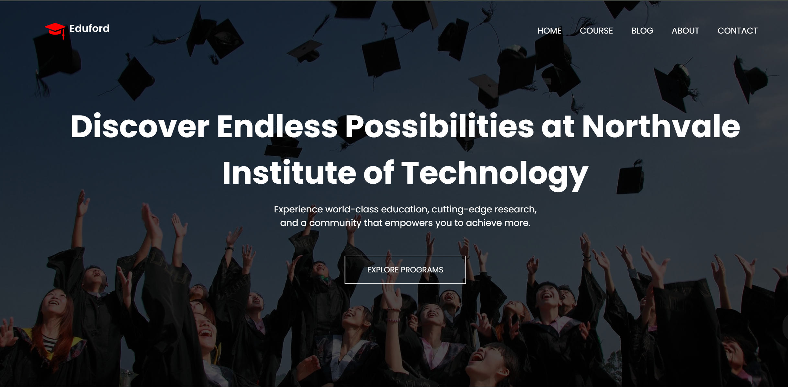

# university-website

This project is a practice ground where I test the concepts I’ve been learning in **HTML** and **CSS**.  
It helps me understand how these skills apply in real-world web development.  

---

## 📸 Preview

---

## Project structure

- `university-website.html` – main page layout  
- `university-website.css` – styling rules  
- `university-website.js` – basic interactivity (if any)  
- `Assets/` – images or media used  

---

## Setup & usage

1. Clone or download the repository  
2. Open `university-website.html` in your browser  
3. Edit the HTML and CSS files to try out new ideas  
4. Refresh the browser to see changes  

---

## Focus areas

- Practicing semantic HTML (headings, sections)  
- Exploring layout techniques (flexbox, grid)  
- Styling with CSS (colors, spacing, responsive design)  
- Adding simple interactivity with JavaScript (optional)  

---

## Learnings & goals

With this repo I aim to:

- Strengthen my understanding of HTML and CSS  
- See how small changes affect a real webpage  
- Build confidence before moving to larger projects  

---

## Ideas to improve

- Add responsive design with media queries  
- Improve accessibility (alt text, labels, roles)  
- Add animations and hover effects  
- Expand into multi-page navigation  
- Try embedding real university-style content (courses, testimonials, etc.)  

---

## Next steps

- Keep experimenting with HTML and CSS features  
- Commit changes regularly to track progress  
- Use this project as a base for more advanced web apps  
